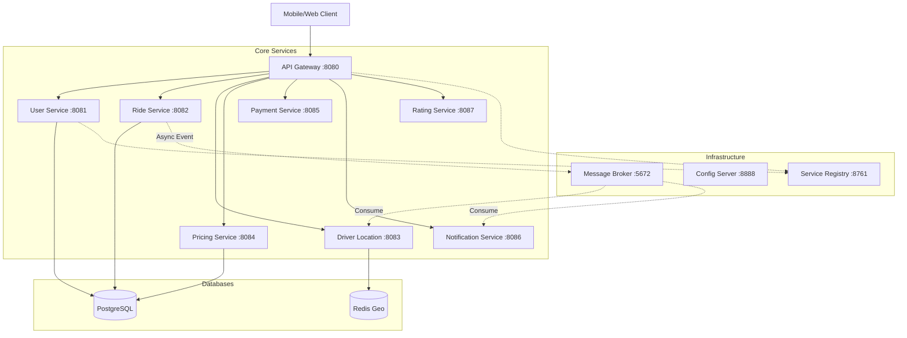

# RideFlux - Microservices Ride-Sharing Platform


**RideFlux** is a robust, production-grade microservices backend for a ride-sharing application. Built within the **Spring Boot ecosystem** and designed for **cloud-native deployment** on **Google Cloud Platform (GCP)**.

It demonstrates advanced distributed system patterns including **Service Discovery**, **API Gateway**, **Centralized Configuration**, **Event-Driven Architecture (RabbitMQ)**, and **Distributed Tracing**.

---

## System Architecture

The system is composed of **10 Microservices** orchestrating the ride lifecycle from booking to payment.



---

## Key Features

-   **Microservices Architecture**: Independently deployable services with loose coupling.
-   **API Gateway**: Centralized entry point with `Spring Cloud Gateway` handling routing and load balancing.
-   **Service Discovery**: Dynamic registration using `Netflix Eureka`.
-   **Event-Driven Communication**: Asynchronous messaging with `RabbitMQ` for ride matching and notifications.
-   **Geo-Spatial Searching**: Real-time driver tracking using `Redis Geospatial` data structures.
-   **Distributed Tracing**: Ready for Zipkin/Sleuth integration.
-   **Containerization**: Fully Dockerized with optimized multi-stage builds.
-   **CI/CD Pipeline**: Automated Build & Deploy via **GitHub Actions** to **GCP**.

---

## Technology Stack

| Category | Technologies |
|----------|--------------|
| **Languages** | Java 17 |
| **Frameworks** | Spring Boot 3, Spring Cloud (Gateway, Config, Eureka, OpenFeign) |
| **Databases** | PostgreSQL (Relational), Redis (Caching & Geo) |
| **Messaging** | RabbitMQ (Event Bus) |
| **DevOps** | Docker, Docker Compose, Kubernetes (Manifests ready) |
| **Cloud** | Google Cloud Platform (Compute Engine, Artifact Registry) |
| **Security** | Spring Security, JWT |

---

## Services Overview

| Service | Port | Description |
|:--------|:----:|:------------|
| **Config Server** | `8888` | Centralized configuration for all services. |
| **Service Registry** | `8761` | Eureka server for service discovery. |
| **API Gateway** | `8080` | Entry point, routing, and filtering. |
| **User Service** | `8081` | User/Driver registration and authentication (JWT). |
| **Ride Service** | `8082` | Core ride logic, booking, and status management. |
| **Driver Location** | `8083` | Tracks driver coordinates using Redis Geo. |
| **Pricing Service** | `8084` | Calculates fares based on distance and demand. |
| **Payment Service** | `8085` | Handles seamless payments and refunds. |
| **Notification** | `8086` | Sends email/SMS alerts (simulated). |
| **Rating Service** | `8087` | Manages driver/rider ratings. |

---

## Getting Started

### Prerequisites
-   Docker & Docker Compose
-   Java 17 (for local dev)
-   Maven

### Run Locally (Docker)
The easiest way to run the entire system is via Docker Compose.

1.  **Clone the repository**
    ```bash
    git clone https://github.com/tusquake/RideFlux.git
    cd RideFlux
    ```

2.  **Start all services**
    ```bash
    docker compose up -d --build
    ```

3.  **Verify Status**
    -   Eureka Dashboard: [http://localhost:8761](http://localhost:8761)
    -   API Gateway Health: [http://localhost:8080/actuator/health](http://localhost:8080/actuator/health)

### API Endpoints (Quick Test)

**1. Register a Rider**
```bash
curl -X POST http://localhost:8080/auth/register \
  -H "Content-Type: application/json" \
  -d '{"name":"John Doe","email":"john@example.com","password":"pass","phone":"1234567890","role":"RIDER"}'
```

**2. Book a Ride**
```bash
curl -X POST http://localhost:8080/api/rides/book \
  -H "Content-Type: application/json" \
  -d '{"riderId":1,"pickupLocation":"Connaught Place","dropoffLocation":"Dwarka","pickupLatitude":28.6315,"pickupLongitude":77.2167,"dropoffLatitude":28.5823,"dropoffLongitude":77.0500}'
```

---

## Cloud Deployment (GCP)

This project is deployed on **Google Cloud Platform (GCP)** using **GitHub Actions**.

### Architecture
-   **Compute**: GCP Compute Engine (Ubuntu VM).
-   **Registry**: GCP Artifact Registry (Docker Images).
-   **Networking**: Custom VPC Firewall rules.
-   **Security**: Minimal privilege IAM Service Accounts.

### Deployment Pipeline
1.  **GitHub Actions** builds Maven JARs.
2.  Builds Docker images & pushes to **GCP Artifact Registry**.
3.  SSHs into the GCP VM.
4.  Pulls latest images and restarts containers via `docker compose`.
